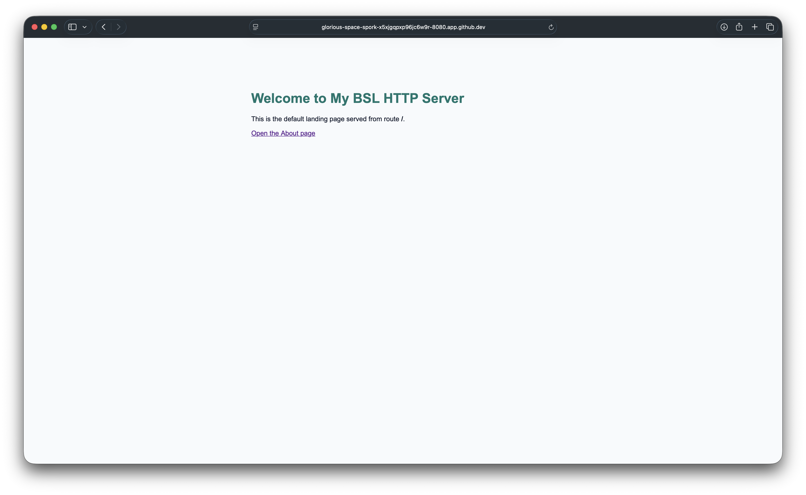
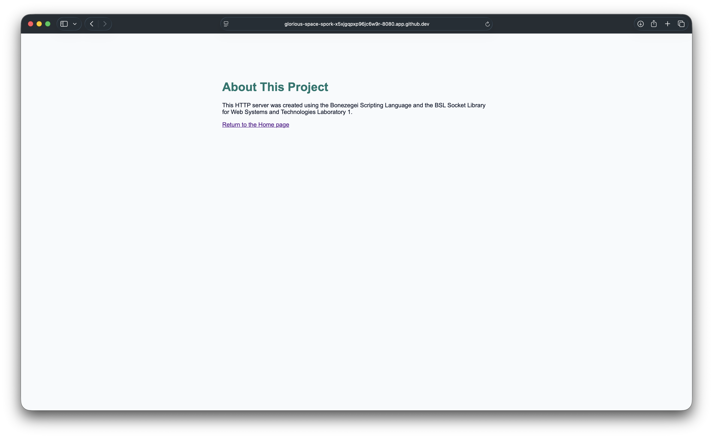
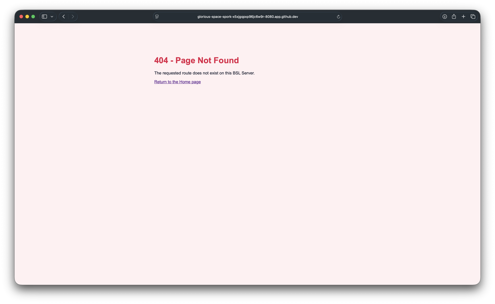
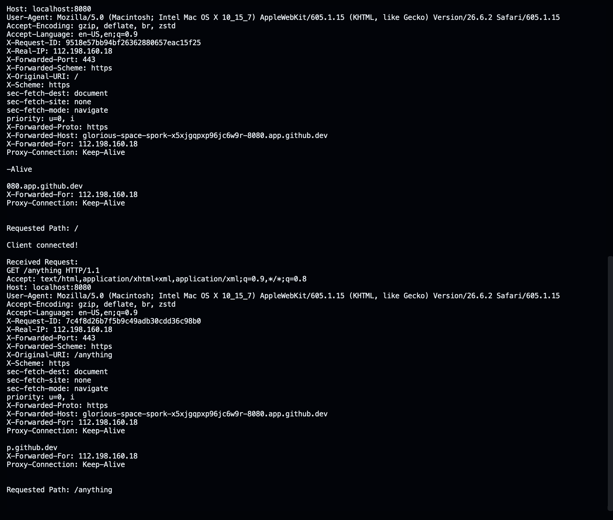

# BSL HTTP Server

## Project Description

This project is a low-level HTTP web server developed using the **Bonezegei Scripting Language (BSL)** and the **BSL_Socket library**.

The server demonstrates the fundamentals of web server communication by creating a TCP socket, binding it to port **8080**, accepting client requests, processing HTTP GET requests, and returning proper HTTP responses.

The implemented server supports:

- Default route (`/`) with a homepage response
- About page (`/about`)
- Custom 404 error page for unknown routes

This project demonstrates how HTTP communication works internally without using existing web frameworks.

---

# Learning Objectives

This project demonstrates the following concepts:

- Creating and initializing TCP sockets
- Binding a server to port 8080
- Listening for incoming client connections
- Accepting browser requests
- Reading HTTP GET requests
- Extracting requested URL paths
- Constructing HTTP response headers and HTML bodies
- Returning correct HTTP status codes:
  - 200 OK
  - 404 Not Found
- Closing client connections after sending responses

---

# Technologies Used

- Bonezegei Scripting Language
- BSL_Socket Library
- GitHub Codespaces
- Visual Studio Code
- HTTP/1.1
- TCP Socket Programming

---

# Installation and Setup

## 1. Install Bonezegei Interpreter

Install the Bonezegei scripting language interpreter.

Verify the installation:

```bash
bonezegei --version
```

Expected output:

```
Bonezegei Script Interpreter
```

---

## 2. Install BSL Socket Library

Install the required socket package:

```bash
bzg install socket
```

Verify available packages:

```bash
bzg --list
```

---

## 3. Clone Repository

Clone this repository:

```bash
git clone <repository-link>
```

Navigate to the project folder:

```bash
cd my-bsl-http-server
```

---

# Running the Server

Run the HTTP server using:

```bash
bonezegei src/http.bzg
```

The terminal should display:

```
Server running on port 8080
```

The server is now ready to receive HTTP requests.

---

# Usage Instructions

Open a browser and access the following routes:

## Home Page

URL:

```
http://localhost:8080/
```

Returns the default homepage response.

---

## About Page

URL:

```
http://localhost:8080/about
```

Returns the about page response.

---

## Unknown Route

Example:

```
http://localhost:8080/test
```

Returns:

```
404 Not Found
```

---

# Screenshots

## Home Route (`/`)



---

## About Route (`/about`)



---

## 404 Error Page



---

## Terminal Running Server



---

# Repository Structure

```text
my-bsl-http-server/

├── .gitattributes
├── LICENSE
├── README.md
│
├── src/
│   └── http.bzg
│
└── documentation/
    ├── home.png
    ├── about.png
    ├── 404.png
    └── terminal.png
```

---

# File Description

| File | Description |
|---|---|
| src/http.bzg | Main BSL HTTP server implementation |
| documentation/ | Contains required screenshots |
| README.md | Project documentation |
| LICENSE | MIT License information |
| .gitattributes | Enables BSL syntax highlighting |

---

# License

This project is licensed under the **MIT License**.